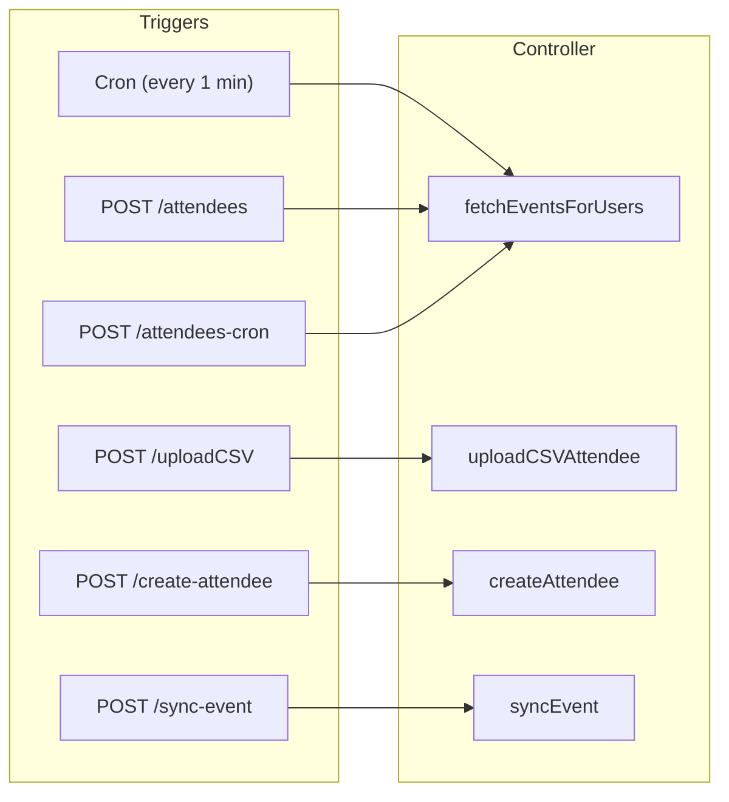
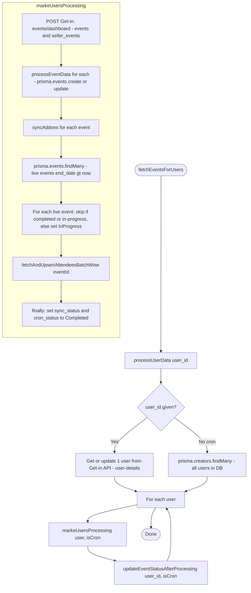
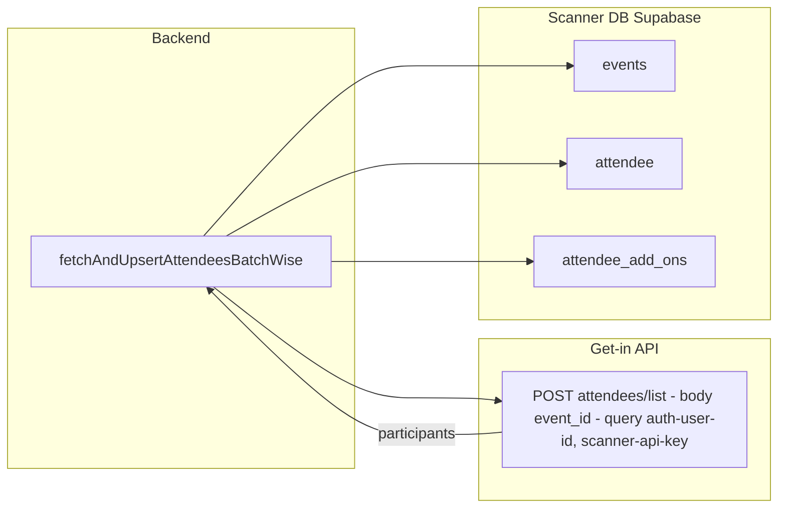
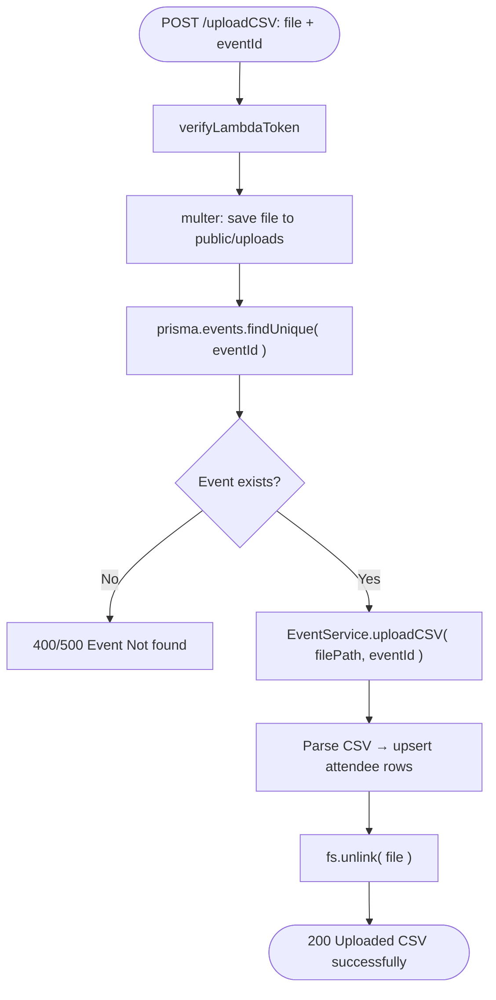
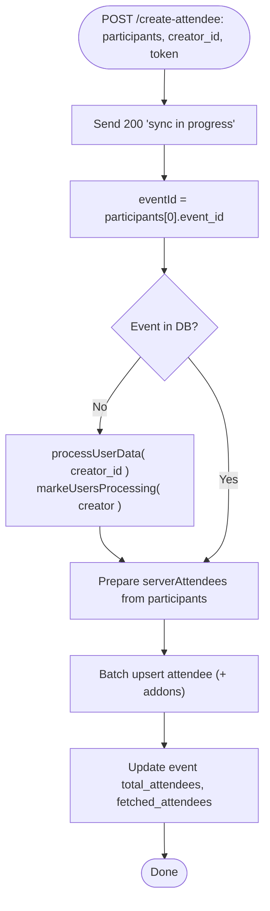
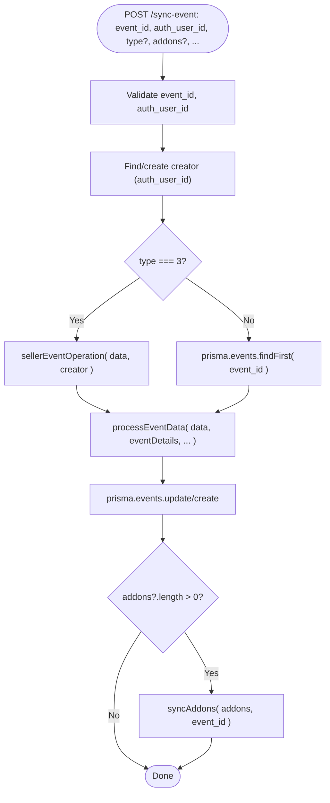

# Getin-Scanner-be – Flow (endpoints, cron, data flow)

Base URL: `/api/v1/events`. All POST routes use **verifyLambdaToken** (query or body `token`).

---

## 1. Entry points overview



| Trigger | Handler | What it does (short) |
|--------|---------|----------------------|
| **Cron** (every 1 min, if DATABASE_URL set) | `fetchEventsForUsers({})` | Sync events + attendees for **all** users from DB |
| **POST /attendees** (body: `user_id`, token) | `fetchEventsForUsers({ user_id, res })` | Sync events + attendees for **one** user |
| **POST /attendees-cron** (body: token) | `fetchEventsForUsers({ isCron: true })` | Same as cron, but triggered by HTTP |
| **POST /uploadCSV** (file + eventId + token) | `uploadCSVAttendee` | Validate event → parse CSV → upsert attendees → delete file |
| **POST /create-attendee** (body: participants, creator_id, token) | `createAttendee` | Upsert attendees from payload; may trigger creator/event sync first |
| **POST /sync-event** (body: event_id, auth_user_id, …) | `syncEvent` | Find/create creator → processEventData → syncAddons |

---

## 2. fetchEventsForUsers flow (cron + /attendees + /attendees-cron)



- **processUserData**: If `user_id` → call Get-in `/users/user-details`, then create/update **creators** in DB and return `[user]`. If no `user_id` (cron) → return all **creators** from DB.
- **markeUsersProcessing**: Fetches events from Get-in dashboard → writes/updates **events** and **add_ons** → for each **live** event fetches attendees from Get-in and upserts **attendee** (+ addons). Sets sync/cron status.

---

## 3. Where attendees come from (fetchAndUpsertAttendeesBatchWise)



- **Single source of truth for list**: Get-in API `POST .../attendees/list` with `event_id`.
- Backend maps `response.data.participants` to your schema and upserts into **attendee** (and add-ons). Also updates **events** (total_attendees, fetched_attendees, sync_status, cron_status).

---

## 4. uploadCSV flow



---

## 5. create-attendee flow



---

## 6. sync-event flow



---

## 7. External APIs used (Get-in)

| Purpose | Method + path | Query / body |
|--------|----------------|---------------|
| Events list | POST `{BACKEND_API_URL}/api/scanner-app/events/dashboard` | `auth-user-id`, `scanner-api-key`; body: `{ filter }` |
| Attendees list | POST `{BACKEND_API_URL}/api/scanner-app/attendees/list` | `auth-user-id`, `scanner-api-key`; body: `{ event_id }` |
| User details | POST `{BACKEND_API_URL}/api/scanner-app/users/user-details` | `auth-user-id`, `scanner-api-key` |

All use **SCANNER_API_KEY** and **BACKEND_API_URL** from env.

**Testing (e.g. curl):** Attendees list requires a JSON body with `event_id`. Empty body can return "This action is unauthorized".

```bash
curl -X POST 'https://api.getin-nextgen.com/api/scanner-app/attendees/list?auth-user-id=14462&scanner-api-key=YOUR_KEY' \
  -H 'Content-Type: application/json' \
  -d '{"event_id": 12803}'
```

---

## 8. Quick reference

- **Cron**: `src/cron.ts` → `fetchEventsForUsers({})` every 1 min (if DATABASE_URL set).
- **Routes**: `src/routes/eventsRoutes.ts` → all under `/api/v1/events`.
- **Controller**: `src/controller/events.controller.ts` (fetchEventsForUsers, markeUsersProcessing, fetchAndUpsertAttendeesBatchWise, processEventData, syncAddons, uploadCSV, createAttendee, syncEvent).
- **Auth**: `verifyLambdaToken` → token from query or body must equal `LAMBDA_TOKEN`.
